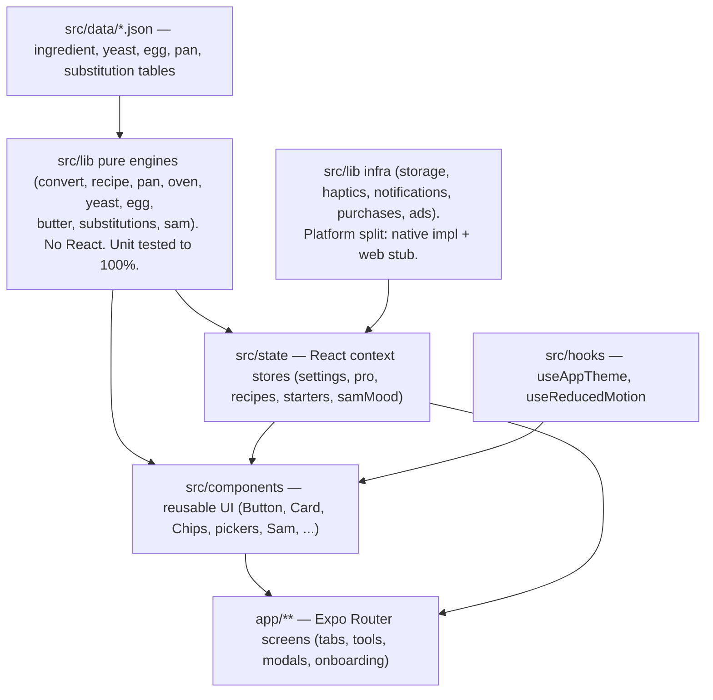
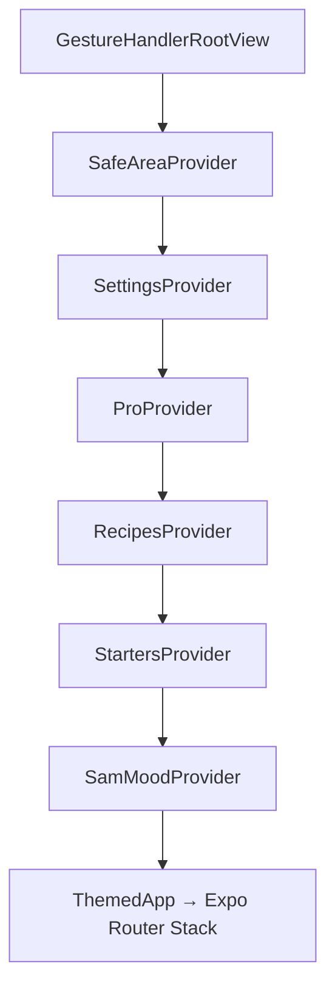

# Doughmate

A cozy mobile baking calculator with a sourdough loaf mascot named **Sam**.
Convert ingredients between volume and weight, scale recipes, swap pans and
temperatures, and keep your sourdough starter fed. React Native + Expo, shipping
to iOS and Android from one codebase.

---

## Repository layout

```
doughmate/
├── app-src/            The Expo application (the code that ships)
└── doughmate-handoff/  Planning + reference: the strategic plan, Sam's voice
                        guide, source data/tokens/strings, and checklists
```

`doughmate-handoff/` is the source of truth for product decisions and content.
Design tokens, i18n strings, and content data were copied from there into
`app-src/src/` and are what actually runs.

## Tech stack

| Concern            | Choice                                                    |
| ------------------ | --------------------------------------------------------- |
| Framework          | React Native + **Expo SDK 57**, React 19, RN 0.86         |
| Language           | TypeScript (strict)                                       |
| Package manager    | pnpm (via corepack)                                       |
| Navigation         | Expo Router (file based, typed routes)                    |
| Animation          | react-native-reanimated 4 (reduced motion aware)          |
| Storage            | MMKV on native, localStorage on web                       |
| i18n               | i18next / react-i18next (typed keys)                      |
| IAP                | RevenueCat (react-native-purchases)                       |
| Ads                | Google Mobile Ads (AdMob)                                 |
| Notifications      | expo-notifications (local feed reminders)                 |
| Mascot             | SVG placeholder now, Lottie (lottie-react-native) later   |
| Tests              | Jest (babel-preset-expo), 100% on the pure engines        |

---

## Architecture

The app is built in clear layers. Data and pure logic sit at the bottom with no
knowledge of React; UI sits on top and consumes them.



### 1. Pure engines (`src/lib/*.ts`)

All the math and lookups are pure functions with no side effects and no React:

- `convert.ts` — volume/weight units and ingredient density conversions
- `recipe.ts` — recipe scaling (parses whole, decimal, fraction, mixed amounts)
- `pan.ts` — pan area math + scale factor + bake time hint
- `oven.ts` — Fahrenheit / Celsius / UK gas marks
- `yeast.ts`, `egg.ts`, `butter.ts` — the secondary converters
- `substitutions.ts` — free tier substitution lookup/search
- `sam.ts` — the reaction system: recipe text → Sam's mood

These are **unit tested to 100% coverage**, enforced by a Jest coverage
threshold. Everything else (UI, native wrappers) is verified by running the app.

### 2. Platform split for native only modules

Native SDKs (MMKV, RevenueCat, AdMob, Lottie) do not run on web. Each is a pair
of files; Metro picks `*.native.*` on device and the plain file on web, so the
**web preview always builds and runs** while native gets the real thing:

| Web / default (stub)      | Native (real)                | Purpose             |
| ------------------------- | ---------------------------- | ------------------- |
| `lib/storage.ts`          | `lib/storage.native.ts`      | key/value storage   |
| `lib/purchases.ts`        | `lib/purchases.native.ts`    | RevenueCat Pro      |
| `lib/ads.ts`              | `lib/ads.native.ts`          | AdMob interstitial  |
| `components/AdBanner.tsx` | `components/AdBanner.native.tsx` | AdMob banner    |
| `components/Sam.tsx`      | `components/Sam.native.tsx`  | SVG vs Lottie Sam   |

`lib/notifications.ts` is a single file that no-ops on web via a `Platform`
check.

### 3. State and persistence

State lives in React context providers under `src/state`, each persisted through
the storage layer. Provider nesting (in `app/_layout.tsx`):



| Store              | Persisted key                | Holds                                     |
| ------------------ | ---------------------------- | ----------------------------------------- |
| `settings.tsx`     | `doughmate.settings.v1`      | theme, a11y, units, flour standard, onboarded |
| `recipes.tsx`      | `doughmate.recipes.v1`       | saved recipes (Recipe Box)                |
| `starters.tsx`     | `doughmate.starters.v1`      | sourdough starters + feed history         |
| `pro.tsx`          | (RevenueCat)                 | Pro entitlement state                     |
| `samMood.tsx`      | in memory                    | Sam's current mood                        |
| notifications      | `doughmate.notif.v1`         | scheduled reminder ids per starter        |
| convert screen     | `doughmate.conversionCount`  | saved conversion count (ad cadence)       |

### 4. Design system and conventions

- **Tokens only.** Colors, spacing, radius, shadow, typography, the three named
  springs, and five named haptics all come from `src/theme.ts`. Never hardcoded.
- **Strings via i18n.** Every user facing string is a key in `src/i18n/en.json`,
  read through `t('key.path')`. Keys are typed against the JSON.
- **Sam's voice: no hyphens or dashes, ever**, in any user facing text. Content
  data was swept to honor this.
- **Accessibility from day one:** dark mode everywhere, reduced motion honored on
  every animation (`useReducedMotion`), and a floured fingers mode that scales
  text (`useAppTheme().fontScale`).

---

## Directory guide

```
app-src/
├── app/                          Expo Router (file based routes)
│   ├── _layout.tsx               Providers, Stack, modal registrations, ads init
│   ├── index.tsx                 Entry redirect (onboarding gate)
│   ├── onboarding/               welcome → features → notifications
│   ├── (tabs)/                   Tab group + floating Sam
│   │   ├── _layout.tsx           Four tabs + Sam overlay (reads SamMood)
│   │   ├── convert.tsx           Main converter (+ Save, ads, Sam celebrate)
│   │   ├── recipes.tsx           Recipe Box (list, delete + undo)
│   │   ├── starters.tsx          Starters (countdown, Feed now, delete + undo)
│   │   └── settings.tsx          Appearance, sound, preferences, Pro, about
│   ├── scaler.tsx                Recipe scaler (modal)
│   ├── more-tools.tsx            Tools hub (modal)
│   ├── pan / oven / yeast / egg / butter / substitutions.tsx   Tool modals
│   ├── recipe-new / starter-new.tsx   Create modals
│   └── paywall.tsx               Doughmate Pro (modal)
└── src/
    ├── theme.ts                  Design tokens (locked)
    ├── i18n/                     en.json + typed i18next setup
    ├── assets/                   sam.svg, lottie/ (mascot animations)
    ├── data/                     ingredient/yeast/egg/pan/substitution tables
    ├── lib/                      pure engines + platform split infra
    ├── components/               reusable UI
    ├── hooks/                    useAppTheme, useReducedMotion
    └── state/                    context stores
```

## Routing map

- Tabs: `/(tabs)/convert`, `/recipes`, `/starters`, `/settings`
- Tool + create + paywall screens are **modals** registered in `app/_layout.tsx`
- First launch is gated by `app/index.tsx`: unonboarded → `/onboarding/welcome`,
  otherwise → `/(tabs)/convert`

## Content data (`src/data`)

Ships as JSON, read only by the engines: 48 ingredients with per cup/tbsp/tsp
gram weights (King Arthur), yeast type ratios, egg size weights, common pans with
areas, and 18 free substitutions.

## Monetization

- **Pro** (RevenueCat, entitlement id `pro`): a single purchase. Unlocks are
  gated in the UI; free limits are `FREE_RECIPE_LIMIT = 10` and
  `FREE_STARTER_LIMIT = 5` (`src/lib/limits.ts`), which route to the paywall.
- **Ads** (AdMob): a banner on Convert / Recipes / Starters and an interstitial
  after every fifth saved conversion. **Hidden entirely for Pro.** Wired with
  Google's public test IDs so it runs without an AdMob account.

## Notifications

`ReminderSync` (mounted at the root) reconciles a local feed reminder per starter
whenever the starters or the reminders setting change, requests permission when
enabled, and cancels everything when disabled. Native only.

## Sam and Lottie

Sam renders from `src/assets/sam.svg` today. `src/assets/lottie/` holds a
placeholder JSON per mood (`idle`, `cookies`, `sourdough`, `macarons`,
`focaccia`, `croissants`, `celebrate`). To go live: drop the real Lottie files in
(same names) and set `LOTTIE_READY = true` in `src/assets/lottie/index.ts`. The
reaction system (`src/lib/sam.ts`) already maps recipe text to these moods.

---

## Running it

```bash
cd app-src
pnpm install
pnpm web           # browser preview (fastest; native modules no-op)
pnpm ios           # or pnpm android — needs a dev build for IAP/ads/push
pnpm start         # dev server

pnpm test          # engine unit tests
pnpm test:coverage # with the 100% threshold
pnpm typecheck     # tsc --noEmit
pnpm lint          # eslint
pnpm format        # prettier --write
```

The **web preview** is the quickest way to see UI changes. Native only features
(purchases, ads, notifications, Lottie) safely no-op there; use a native **dev
build** (`eas build` or `expo run:ios|android`) to exercise them on a device.

## Activation checklist (before shipping)

1. **RevenueCat** — create the `pro` entitlement, product, and offering; set
   `EXPO_PUBLIC_REVENUECAT_KEY_IOS` / `EXPO_PUBLIC_REVENUECAT_KEY_ANDROID` in
   `.env.local` (see `.env.local.example`).
2. **AdMob** — replace the test App IDs in `app.json` and the `TestIds.*` in
   `lib/ads.native.ts` and `components/AdBanner.native.tsx` with real unit IDs.
3. **Sam** — drop the Fiverr Lottie files into `src/assets/lottie/` and flip
   `LOTTIE_READY`.
4. Custom fonts (Fredoka, Nunito, SF Mono referenced in `theme.ts`) still need
   loading via `expo-font`.

## House rules

See `doughmate-handoff/CLAUDE.md`. In short: no hyphens in user facing copy;
design tokens only; strings via i18n; the three named springs and five named
haptics only; reduced motion honored and dark mode supported everywhere.
